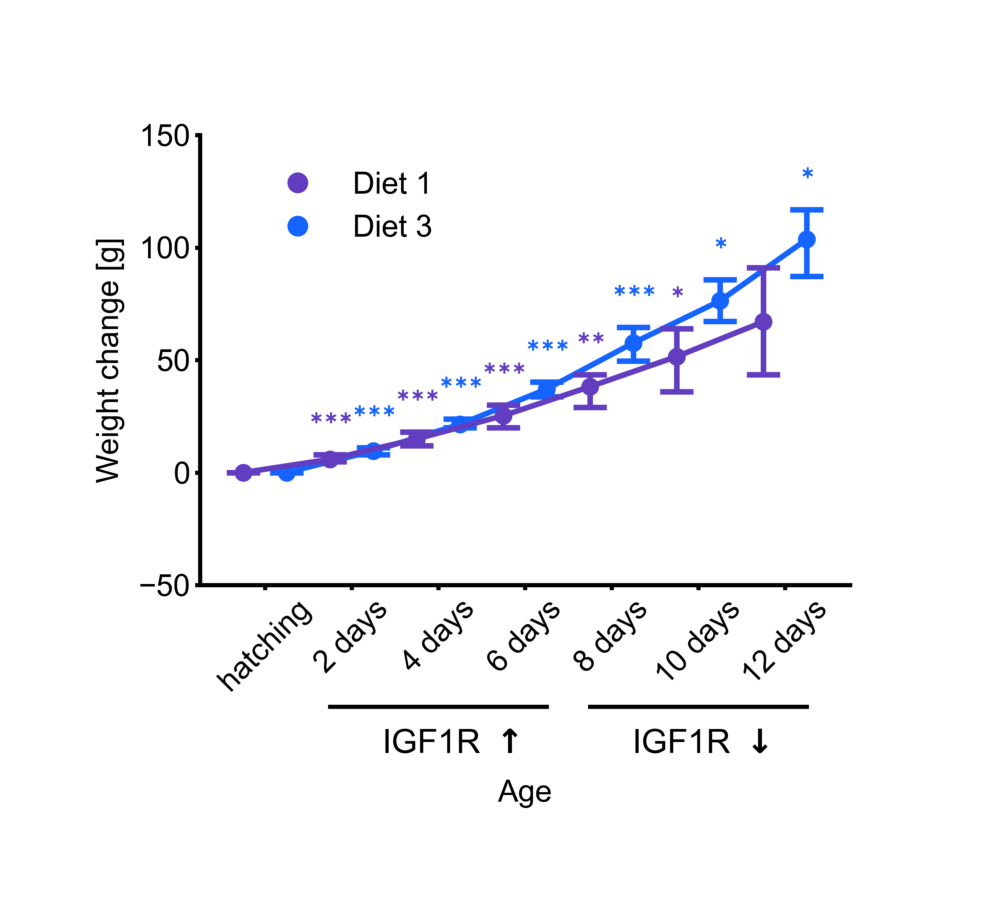

# Line Plot
Script to generate a line plot with error bars. The plot uses the chick weight dataset for demonstration. 

The publication featuring the dataset used for demonstration (Crowder & Hand, 1990), the publications used for confirming weight units (Knížetová et al, 1991; Roberts, 1964), and the publications from which insulin-like growth factor 1 receptor information was retrieved (Duclos & Goddard, 1990; Kim, 2000) are listed below:

- Crowder, M. J., & Hand, D. J. (1990). Analysis of repeated measures (Vol. 41). CRC Press.
- [Knížetová, H., Hyanek, J., Kníže, B., & Roubíček, J. (1991). Analysis of growth curves of fowl. I. Chickens. British Poultry Science, 32(5), 1027-1038.](https://doi.org/10.1080/00071669108417427)
- [Roberts, C. W. (1964). Estimation of early growth rate in the chicken. Poultry Science, 43(1), 238-252.](https://doi.org/10.3382/ps.0430238)
- [Duclos, M. J., & Goddard, C. (1990). Insulin-like growth factor receptors in chicken liver membranes: binding properties, specificity, developmental pattern and evidence for a single receptor type. Journal of endocrinology, 125(2), 199-206.](https://doi.org/10.1677/joe.0.1250199)
- [Kim, J. W. (2010). The endocrine regulation of chicken growth. Asian-Australasian Journal of Animal Sciences, 23(12), 1668-1676.](https://doi.org/10.5713/ajas.2010.10329)

installation:

```bash
pip install -r requirements.txt
```

usage:

```bash
python line_plot.py
```

Cite As

[Nzakimuena, C. B., Solano, M. M., Marcotte-Collard, R., Lesk, M. R., & Costantino, S. (2025). Spatial and temporal changes in choroid morphology associated with long-duration spaceflight. Investigative Ophthalmology & Visual Science, 66(5), 17-17.](https://doi.org/10.1167/iovs.66.5.17)

